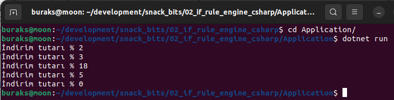
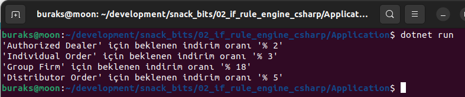

# Çok Fazla If Bloğu Yerine Rule Engine Kullanmak

Kod kalite metriklerini artırmak için yaptığımız çalışmalardan birisi de fonksiyonların Cognitive Complexity değerlerini azaltmak için if, switch gibi yapıları strateji deseni kullanarak ortadan kaldırmak. Ancak bazen öyle bloklara denk gelebiliyoruz ki, olay belirli koşullar gerçekleştiğinde bir değer döndürmek üzerine dayalı oluyor. Mesela bir siparişte iskonto oranını belirlemek için state nesnelerinin belli koşulları sağlayıp sağlamadığına bakmak gibi. Bu tip kurgular kod tabanı içerisinde çok fazla olduğunda belki bir kural motoru ile yönetmek düşünülebilir. Bunun over-engineering olduğunu da göz ardı etmemek lazım. Ama bir deneyip görmekte yarar var. Merak işte :D Aşağıdaki program kodunu ele alalım.

```csharp
using Domain;

public class Program
{
    static void Main()
    {
        var monitor = new Product
        {
            Id = 1,
            Title = "Widescreen 42 inch Full HD Curve monitor",
            ListPrice = 1000M,
            StockLevel = 12
        };

        var orders = new List<Order>
            {
                new Order
                {
                    Id = 1001,
                    Date = DateTime.Now,
                    CustomerType = CustomerType.AuthorizedDealer,
                    ProductId = monitor.Id,
                    Quantity = 2
                },
                new Order
                {
                    Id = 1002,
                    Date = DateTime.Now,
                    CustomerType = CustomerType.Individual,
                    ProductId = monitor.Id,
                    Quantity = 2
                },
                new Order
                {
                    Id = 1003,
                    Date = DateTime.Now,
                    CustomerType = CustomerType.GroupFirm,
                    ProductId = monitor.Id,
                    Quantity = 3
                },
                new Order
                {
                    Id = 1004,
                    Date = DateTime.Now,
                    CustomerType = CustomerType.Distributor,
                    ProductId = monitor.Id,
                    Quantity = 1
                },
                new Order
                {
                    Id = 1005,
                    Date = DateTime.Now,
                    CustomerType = CustomerType.Seller,
                    ProductId = monitor.Id,
                    Quantity = 1
                }
            };

        foreach (var order in orders)
        {
            if (order.Quantity < monitor.StockLevel)
            {
                int discountRate;
                switch (order.CustomerType)
                {
                    case CustomerType.AuthorizedDealer:
                        discountRate = 2;
                        break;
                    case CustomerType.Distributor:
                        discountRate = 5;
                        break;
                    case CustomerType.Individual:
                        discountRate = 3;
                        break;
                    case CustomerType.GroupFirm:
                        discountRate = 18;
                        break;
                    default:
                        discountRate = 0;
                        break;
                }
                Console.WriteLine($"İndirim tutarı % {discountRate}");
            }
        }
    }
}

namespace Domain
{
    public class Product
    {
        public int Id { get; set; }
        public string Title { get; set; } = String.Empty;
        public decimal ListPrice { get; set; }
        public int StockLevel { get; set; }
    }

    public class Order
    {
        public int Id { get; set; }
        public DateTime Date { get; set; }
        public CustomerType CustomerType { get; set; }
        public int ProductId { get; set; }
        public int Quantity { get; set; }
    }

    public enum CustomerType
    {
        AuthorizedDealer,
        Distributor,
        Individual,
        GroupFirm,
        Seller
    }
}
```

Örnek kod parçasında bir ürünle ilgili birkaç tane sipariş nesnesi yer alıyor. Siparişi veren müşteri tipine ve stok durumuna göre de iskonto oranı belirleniyor. Bunun için çok doğal olarak sadece if...else kullanmamız yeterli ve bundan hiçbir sorun yok. Çalışma zamanı çıktısı da aşağıdaki gibi.



Şimdi bu işleyişi birde kural motoru yoluyla işletmeye çalışalım. .Net tarafında oldukça fazla sayıda kural motoru bulunuyor. Bunlardan birisi de oldukça popüler bir indirme sayısına sahip olan [RulesEngine](https://www.nuget.org/packages/RulesEngine). Şimdi bunu programımıza paket olarak ekleyelim.

```bash
dotnet add package RulesEngine
```

Ardından uygulama kodlarımızı aşağıdaki gibi değiştirelim.

```csharp
using Domain;
using RulesEngine.Models;

public class Program
{
    static void Main()
    {
        var monitor = new Product
        {
            Id = 1,
            Title = "Widescreen 42 inch Full HD Curve monitor",
            ListPrice = 1000M,
            StockLevel = 12
        };

        var orders = new List<Order>
            {
                new Order
                {
                    Id = 1001,
                    Date = DateTime.Now,
                    CustomerType = CustomerType.AuthorizedDealer,
                    ProductId = monitor.Id,
                    Quantity = 2
                },
                new Order
                {
                    Id = 1002,
                    Date = DateTime.Now,
                    CustomerType = CustomerType.Individual,
                    ProductId = monitor.Id,
                    Quantity = 2
                },
                new Order
                {
                    Id = 1003,
                    Date = DateTime.Now,
                    CustomerType = CustomerType.GroupFirm,
                    ProductId = monitor.Id,
                    Quantity = 3
                },
                new Order
                {
                    Id = 1004,
                    Date = DateTime.Now,
                    CustomerType = CustomerType.Distributor,
                    ProductId = monitor.Id,
                    Quantity = 1
                },
                new Order
                {
                    Id = 1005,
                    Date = DateTime.Now,
                    CustomerType = CustomerType.Seller,
                    ProductId = monitor.Id,
                    Quantity = 1
                }
            };

        #region Rule Engine State

        var workflows = new List<Workflow>() {
                new Workflow
                    {
                        WorkflowName = "Discounting Rules",
                        Rules = new List<Rule>
                        {
                            new Rule
                            {
                                RuleName="Individual Order",
                                Expression = "input2.Quantity < input1.StockLevel && input2.CustomerType == CustomerType.Individual",
                                RuleExpressionType = RuleExpressionType.LambdaExpression,
                                Actions = new RuleActions
                                {
                                    OnSuccess= new ActionInfo
                                    {
                                        Name = "OutputExpression",
                                        Context = new Dictionary<string, object>()
                                        {
                                            { "Expression",3 }
                                        }
                                    }
                                }
                            },
                            new Rule
                            {
                                RuleName="Distributor Order",
                                Expression = "input2.Quantity < input1.StockLevel && input2.CustomerType == CustomerType.Distributor",
                                RuleExpressionType = RuleExpressionType.LambdaExpression,
                                Actions = new RuleActions
                                {
                                    OnSuccess= new ActionInfo
                                    {
                                        Name = "OutputExpression",
                                        Context = new Dictionary<string, object>()
                                        {
                                            { "Expression",5 }
                                        }
                                    }
                                }
                            },
                            new Rule
                            {
                                RuleName="Authorized Dealer",
                                Expression = "input2.Quantity < input1.StockLevel && input2.CustomerType == CustomerType.AuthorizedDealer",
                                RuleExpressionType = RuleExpressionType.LambdaExpression,
                                Actions = new RuleActions
                                {
                                    OnSuccess= new ActionInfo
                                    {
                                        Name = "OutputExpression",
                                        Context = new Dictionary<string, object>()
                                        {
                                            { "Expression",2 }
                                        }
                                    }
                                }
                            },
                            new Rule
                            {
                                RuleName="Group Firm",
                                Expression = "input2.Quantity < input1.StockLevel && input2.CustomerType == CustomerType.GroupFirm",
                                RuleExpressionType = RuleExpressionType.LambdaExpression,
                                Actions = new RuleActions
                                {
                                    OnSuccess= new ActionInfo
                                    {
                                        Name = "OutputExpression",
                                        Context = new Dictionary<string, object>()
                                        {
                                            { "Expression",18 }
                                        }
                                    }
                                }
                            }
                        }
                }
            };

        var ruleEngine = new RulesEngine.RulesEngine(workflows.ToArray());
        foreach (var order in orders)
        {
            var inputs = new dynamic[]
                        {
                                monitor,
                                order,
                                order.CustomerType
                        };
            var results = ruleEngine.ExecuteAllRulesAsync("Discounting Rules", inputs).Result;
            foreach (var ruleResult in results)
            {
                if (ruleResult.ActionResult != null && ruleResult.IsSuccess)
                {
                    Console.WriteLine($"'{ruleResult.Rule.RuleName}' için beklenen indirim oranı '% {ruleResult.ActionResult.Output}'");
                }
            }
        }

        #endregion

    }
}

namespace Domain
{
    public class Product
    {
        public int Id { get; set; }
        public string Title { get; set; } = String.Empty;
        public decimal ListPrice { get; set; }
        public int StockLevel { get; set; }
    }

    public class Order
    {
        public int Id { get; set; }
        public DateTime Date { get; set; }
        public CustomerType CustomerType { get; set; }
        public int ProductId { get; set; }
        public int Quantity { get; set; }
    }

    public enum CustomerType
    {
        AuthorizedDealer,
        Distributor,
        Individual,
        GroupFirm,
        Seller
    }
}
```

Evet evet sizi duyar gibiyim... Birkaç satır if yerine çok daha fazla kod satırı ile üstelikte çalışma zamanında daha yavaş çalışacağı aşikar olan bir kural motoru kullandık. Yine de milyon satır kod barındıran ürünlerden yüzlerce if bloğunda bu şekilde kurallar işletip sadece nesne state'leri üstünden değişiklikler yapıyorsak göz önüne alınabilir diye düşünüyorum.

