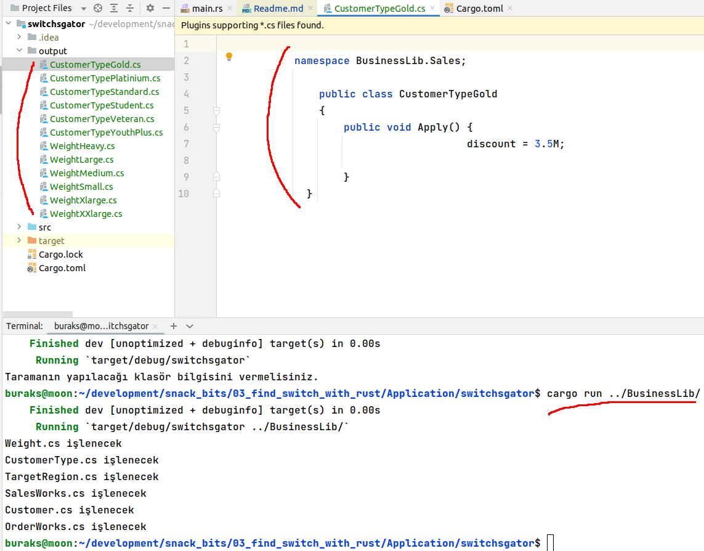

# Kod Dosyalarındaki switch_case Bloklarını Rust ile Bulmak

Yılların birikimi olmuş milyon satırlık kod tabanlarında kalabalıklaşan iş süreçleri sebebiyle yoğun if..else veya switch bloğu kullanımın rastlayabiliyoruz. Kod kalitesinin artırılması noktasında bu blokların birer bağımlılık olarak dışarıya alınması da cognitive complexity gibi değerlerin düşürülmesi noktasında önemli. Burada merak ettiğim C# tarafındaki kod dosyalarını Rust ile tarayabilir miyim? Hatta işleri hızlandırmak için thread'ler açıp bu işlemi gerçekleştirebilir miyim? İlk etapta blokları tespit etmek yeterli. İkinci adımda ise bu blokları alıp ayrı bir şablonla çarpıştırık çıktı elde etmek istiyorum. Örneğin her bir case bloğunun kodun dışına çıkarılıp case adında bir sınıfın Apply isimli bir fonksiyonu içerisine alınması, belli bir interface'ten türetilmesi gibi. Üçüncü ve en zor adım ise case bloğunda dışarıdan gelen parametrelerin tespit edilip Apply metoduna parametre olarak geçilebilecek bir sınıf modeli altında birleştirilmesi. Bu ilk örnek sadece dosya tarama, case bloklarını tespit edip ekrana basma üzerine bir çalışma gibi düşünülebilir.

## İlk Sonuçlar

İlk etapta dosyaları satır satır ama her dosya için ayrı bir thread açarak işlem yapan bir kod parçası söz konusu. cs uzantılı dosyalar satır satır taranmakta, switch blokları yakalanmakta, case'lerin içerikle case adı ile ayrı bir sınıf dosyasına alınmakta. Örnek çözümdeki .net uygulaması için kabaca aşağıdaki gibi bir çıktı söz konusu.



Bu ilk çözümün **handikapları** aşağıdaki gibi sıralanabilir,

- Taranacak c# dosyalarının sayısının fazla olması halinde herbir dosya için thread açmak mantıklı olmayabilir. Belli gruplar halinde veya klasör bazlı bir thread paylaşımı daha iyi olabilir.
- C# dosyalarını satır bazlı olarak taramaktayım. Binlerce satırlık sınıf dosyaları içeren legacy sistemlere aşinayız. Bu noktada satır satır dosya taramak pek iyi bir çözüm değil gibi duruyor. Daha hızlı sonuca ulaşabileceğim bir tarama yöntemi bulmam lazım.
- Şu an için üretilen c# dosyalarındaki formatlama hatalı durumda. Formatlama meselesini nasıl çözebilirim.
- Apply metodu oldukça standart. Fonksiyonun case bloğundaki kod parçasına göre alması gereken parametreler varsa bunu anlayamıyoruz.

## Çalışma Zamanı

Örneğe clap küfesi eklendikten sonra çalıştırmak için aşağıdaki gibi ilerlenebilir.

```bash
# multi mode için
cargo run -- -m multi -s ../BusinessLib

# single mode için
cargo run -- -m single -s ../BusinessLib
```