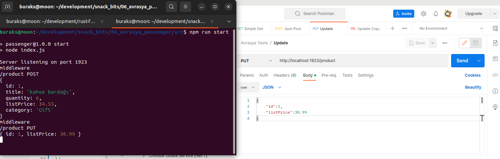
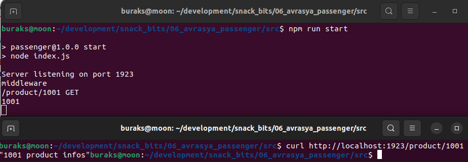

# Avrasya Client

Muhtalip Dede tarafından geliştirilen Nodejs ve Typescript menşeeli Avrasya Web Framework'ünü deniyorum. Olası notları bu dokümanda toplayabilirim.

## Projenin Oluşturulması

Tabii öncesinde sistemde Nodejs olması gerektiğini hatırlatalım. Moon'da eski bir sürüm vardı. Epeydir nodejs ile yazmıyorum tabi. [Şu adresteki](https://www.hostingadvice.com/how-to/update-node-js-latest-version/) yazıya bakıo nvm komutları ile güncelledim.

```shell
sudo apt-get update
sudo apt-get install build-essential checkinstall libssl-dev
curl -o- https://raw.githubusercontent.com/creationix/nvm/v0.32.1/install.sh | bash

# nvm 21.1.1 içerisinde npm ile birlikte geliyor
nvm install 21.1.0

# sonrasında versiyon kontrolleri
node -v
npm -v

# Her şey yoluna girince yeni projeyi oluşturdum
mkdir src
cd src
npm init
touch index.js

# Ardından avrasya paketini ekledim
npm install avrasya

# Örneği çalıştırmak içinse
npm run start
```


Repodaki örnek kodlar Typescript ile yazılmış. Ben javascript ile denemek istedim. Aşağıdaki gibi bir hata mesajı aldım. Kıt Nodejs bilgime göre hatalı bir şey de yapmış olabilirim tabii.


Bunun üzerine package.json'a hata mesajında önerdiği üzere "type":"module" bildirimini ekledim. Bu başka bir probleme neden oldu.


Bakalım. Şimdilik burada kaldım. Konu ile ilgili bir de [issue açtım](https://github.com/muhtalipdede/avrasya/issues/1).

Issue çözümlendikten sonra başarılı şekilde sunucuyu çalıştırıp basit HTTP çağrıları yapabildim. Get, Post, Put ve Delete çağrımlarını deniyorum.



Ancak şimdi farklı bir yerde takıldım. Şu anda parametrik çağrımları gerçekleştiremiyorum. Örneğin http://localhost:1923/product/1234 adresine bir HTTP Get talebi gönderdiğimde 1234 değerini alıp bir şeyler yapabilmek istiyorum. Parametre kullanımım yanlış da olabilir tabii. Konu ile ilgili [yeni bir issue](https://github.com/muhtalipdede/avrasya/issues/3) açarak repoya katkı vermeye çalışıyorum.

Açılan issue için gelen cevaba göre parametreyi şu şekilde kullanmak gerekiyor.

```js
import avrasya from "avrasya";

const server = new avrasya.default();

server.router.get("/product/:id", (ctx) => {
    console.log(ctx.params["id"]);
    ctx.send(ctx.params["id"] + " product infos");
});

server.listen(1923);
```

Buna göre çalışma zamanında aşağıdaki sonuçları elde edebildim.

