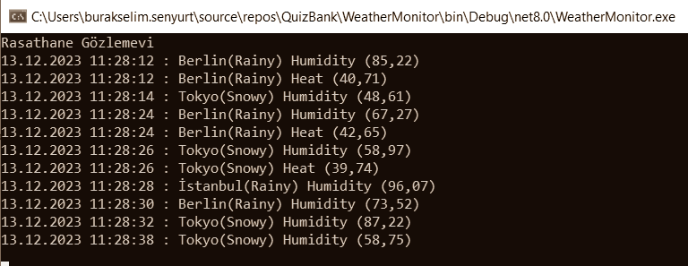

# Event Kavramını Hatırlamak

Olay nesneleri C# tarafında bana kalırsa önemli yeteneklerden birisi ama çok sık kullanmıyor olabiliriz. Bir nesnenin temsil ettiği verideki değişiklikler sonrası bu nesneyi kullanan tarafından bir aksiyon almasını sağlamak için olaylar _(events)_ kullanılabilir. Bu örnekteki amacım olay yazmayı hatırlamak idi. Örneğe kobay olan Location isimli sınıf tasarımında güya şehirlerin sıcaklık, nem ve hava bilgisi tutuluyor. Bu veri setindeki sıcaklık ve nem oranlarındaki değişimlere göre ortama olaylar fırlatabiliyoruz. Örneğin sıcaklık değeri o lokasyon için 50 derece üstüne veya nem değeri 90'ın üstüne çıktığında event'ler tetikleniyor. Bu event'lere abone olan bir çalışma zamanında çeşitli aksiyonlar alınabilir. Ben durumu terminal penceresinden daha eğlenceli izlenebilir hale getirmek için sonsuz döngü ve rastgele sayı üretici kullandım. İşte örnek bir çalışma zamanı görüntüsü.

