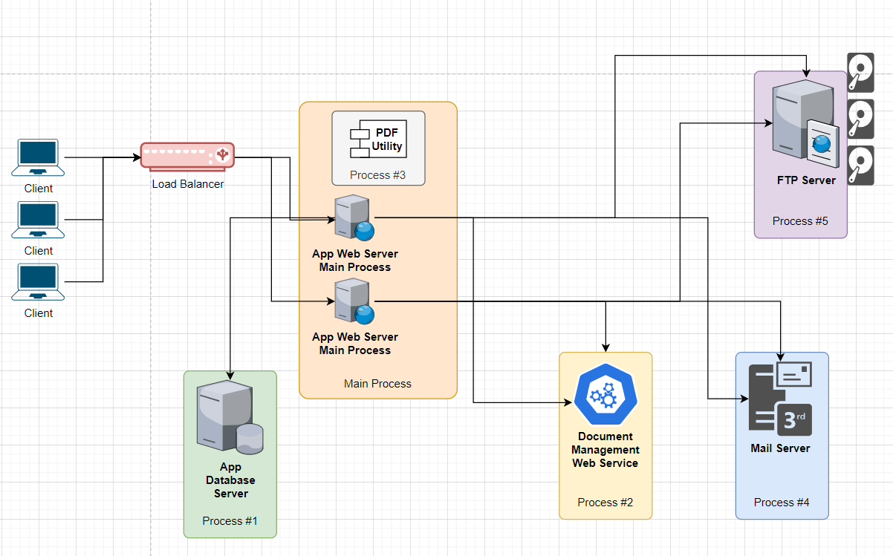

# Enerji Sarfiyatı Yüksek Kodlama Senaryosu

Senaryoda büyük bir **ERP** sisteminde çalışan bir müşteri isteği ele alınmaktadır. Bu isteğin karşılanması için örnek bir fonksiyonellik geliştirilmiştir ancak bu işlev enerji tüketimi açısından negatif etkiler bırakmaktadır.Özellikle işlem süresi bazı hallerde çok fazla sürmekte ve ana web uygulamasının timeout vererek beklenmedik şekilde kırılmasına sebebiyet vermektedir. Kod özelinde bakıldığında **SOLID**'in bazı ilkelerinin de ihlal edildiği görülmektedir. Çalışmadaki amaçlardan birisi bu tip bir senaryonun olası etkilerini ve çözüm yollarını tartışmaktır.

## Müşteri İsteği

Müşteri tarafından istenen istek şu şekildedir;

"Bir yönetmen olarak İş Emri Talimatı oluşturduğum ekranda birden fazla talimata ait PDF dosyalarını tek tek ürettirmekte ve sonrasında kendi bilgilsayarıma indirdiğim bu dökümanları yardımcı bir program aracılığı ile birleştirerek ilgili kurumlara e-posta eki halinde göndermekteyim. Gün içerisinde bu tip talimatlardan minimum 100 maksimum 1000 adet gelebilmekte. Yönetmen olarak ilgili ekranda seçtiğim talimalatlar için üretilen PDF'lerin tek seferde oluşturulmasını, tek bir PDF içerisinde birleştirilmesini ve otomatik olarak ilgili paydaşa e-posta eki olarak gönderilmesini istiyorum."

## High Level Diagram

Hali hazırda uygulanmış olan çözümün çalıştırdığı proccess'ler ve entegrasyon noktaları aşağıdaki gibi özetlenebilir.

| Process      	| Bilgi                                                                               	|
|--------------	|-------------------------------------------------------------------------------------	|
| Main Process 	| Ana ERP sistemi, .Net Web Uygulaması, .Net Runtime                                  	|
| Process 1    	| RDBMS, Database Server                                                              	|
| Process 2    	| Document Server, XML Web Service, byte[] dönen fonksiyon                            	|
| Process 3    	| PDF Utility, Main Process içerisinde çalışan PDF yönetim aracı, 3rd Party Component 	|
| Process 4    	| Mail Server                                                                         	|
| Process 5    	| FTP Server                                                                          	|

Topolojiyi kaba taslak aşağıdaki grafikte olduğu gibi hayal edebiliriz.

Görüldüğü üzere dağıtık sistem üzerine yayılmış bir işlevsellik söz konusudur. Gelen talep ana uygulamanın yer aldığı web sunucusu üzerinde işletilir. Web uygulamasına ait process zaten kendi kaynaklarını tüketmektedir. İşlev içerisinde birkaç kez gidilen veritabanı sunucusu, doküman çekmek için kullanılan servis uygulamasının yer aldığı sunucu da kendi kaynaklarını tüketmektedir. İşlem sonucu e-posta ile bildirileceğinden bir Mail sunucusu ve kaynaklarının tüketimi de söz konusudur. Ayrıca çıktı olarak oluşan dokümanının e-posta ile gönderilememesi durumunda bu içeriğin FTP sunucusu üzerinden disk ortamına alınması tercih edilmektedir. Bu da ekstra disk kullanımı ve bakım maliyeti anlamına gelmektedir.

## Problemler

Uygulanan sistemde çok fazla process çalıştığı görülmektedir. Bu process'lerin farklı makinelerde olduğu düşünülürse söz konusu dağıtık sistemin toplamda tükettiği ram, cpu ve disk ihtiyacının yüksek olacağı söylenebilir. Ayrıca ana fonksiyon birden fazla sorumluluğu üstenmekte olup hem Single Responsibility hem Open/Closed hem de Dependency Inversion ilkelerini ihlal etmektedir. Diğer yandan kodun ilk versiyonu O(n2) gibi bir maliyete sahip olabilir. Entegrasyon noktalarında oluşabilecek istisnai durumların yönetimi de bellek tüketimini artıracak etkenlerden birisi olarak görülebilir. Hatta hata noktalarında tekrar yapılacak deneme çağrıları sayısının fazlalaşması söz konusu kaynak harcama döngüsünün yinelenmesine anlamına gelecektir _(kod senaryosunu karmaşıklaştırmamak adına eklenmedi)_

## Çözüm Tartışmaları

Daha sürdürülebilir ve özellikle enerji dostu bir çözüm noktasında aşağıdaki başlıklarda tartışmalar yapılabilir.

- Müşterinin geçerli bir gerekçeye dayanan isteğine ait iş modeli yeniden gözden geçirilebilir.
- İhlal edilen SOLID ilkelerine göre kod yeniden düzenlenebilir.
- Retry mekanizmalarının iyileştirilmesine çalışılabilir.
- FTP erişimi, döküman sunucusu gibi enstrümanların aradan çıkarılıp çıkarılmayacağına bakılabilir.
- Çok fazla sayıda dokümanın bir araya getirilmesi yerine hepsinin yerine geçerli sayılabilecek tek sayfalık bir belgenin oluşturulup oluşturulmayacağı üzerine gidilebilir.

## Sorular

- İlk kod modelinin tükettiği toplam enerji miktarı hangi metodoloji ile nasıl ölçümlenir?
- Bu senaryodaki iş modelinin değişmeyeceği düşünülürse ideal çözüm senaryoları neler olabilir?
- Dokuman sunucusundan belge döndüren servis daha az kaynak tüketen daha hızlı çalışan alternatif bir modelde _(örneğin rust dili ile unmanaged ortamda)_ geliştirilebilir mi?
- Komple tüm .Net stack'i terk edilip alternatif bir otama geçilebilir mi?
- Çözüm bulut tabanlı sisteme taşınabilir mi?